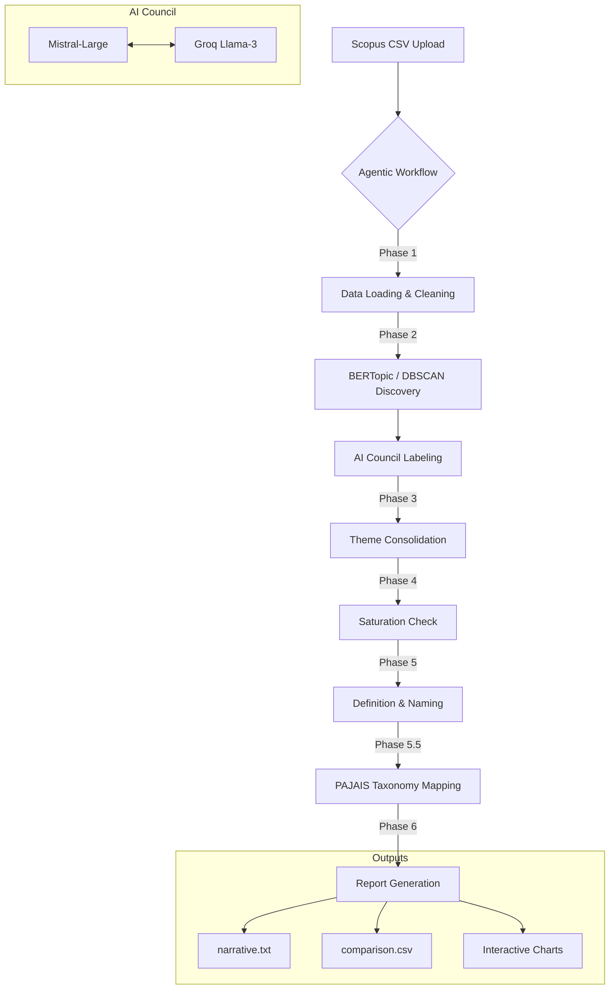

# 🔬 BERTopic Agentic Topic Modelling

### *Computational Thematic Analysis powered by Braun & Clarke (2006)*


---

## 🌟 Overview

**BERTopic Agentic Topic Modelling** is a state-of-the-art research tool designed to automate and enhance the process of **Thematic Analysis** for academic literature. By integrating **BERTopic**'s transformer-based clustering with a **LangGraph-driven agentic workflow**, this application guides researchers through the rigorous 6-phase framework of Braun & Clarke (2006).

It doesn't just cluster text; it *reasons* about it. Featuring a unique **"AI Council"** where multiple Large Language Models (Mistral & Groq) debate and reach consensus on topic labels, the tool ensures high-fidelity, publishable results.

---

## 🧠 Theoretical Foundation: Braun & Clarke (2006)

This tool is strictly mapped to the six phases of thematic analysis as defined in the seminal work:

1.  **Familiarisation with data**: Automatic cleaning, boilerplate removal, and dataset profiling.
2.  **Generating initial codes**: BERTopic discovery and AI-assisted initial labeling.
3.  **Searching for themes**: LLM-driven consolidation of topics into overarching themes.
4.  **Reviewing potential themes**: Saturation checks and coverage analysis.
5.  **Defining and naming themes**: Generation of academic definitions and core narratives.
6.  **Producing the report**: Narrative writing (Section 7 draft) and PAJAIS taxonomy mapping.

---

## ✨ Key Features

- **🤖 Agentic Workflow**: A LangGraph agent manages the entire pipeline, maintaining memory and ensuring a step-by-step scientific process.
- **⚖️ AI Council**: Real-time debates between **Mistral-Large** and **Llama-3 (Groq)** to determine the most accurate thematic labels.
- **📊 Dynamic Visualizations**: 8+ interactive Plotly charts (Intertopic maps, Frequency bars, Heatmaps, Treemaps, and DBSCAN scatter plots).
- **🛡️ Multi-Model Analysis**: Run separate analyses on **Abstracts** vs. **Titles** and generate a side-by-side convergence CSV.
- **🔍 Density Refinement**: Optional **DBSCAN** clustering to complement traditional hierarchical methods and handle noise points elegantly.
- **🏷️ PAJAIS Taxonomy Mapping**: Automated gap analysis by mapping themes to the standard 25 PAJAIS Information Systems categories.
- **📥 One-Click Export**: Download structured JSON, side-by-side CSVs, PNG charts, and a 500-word academic narrative report.

---

## 🛠️ Architecture



---

## 🖥️ App Navigation & Expected UI

The interface is divided into three logical zones for a streamlined user experience:

### 1. Control Center (Top & Left)
- **Phase Progress Bar**: A visual indicator of your progress through Braun & Clarke’s 6 phases.
- **Data Input (Left)**: The upload zone for your Scopus CSV. Once uploaded, Phase 1 triggers automatically.

### 2. The Agent Laboratory (Center)
- **Chatbot Interface**: Your main point of interaction. The agent will ask questions, provide stats, and guide you. You can type commands like "run abstract" or "Continue".
- **AI Council Feedback**: Every time a label is generated, look for the reasoning block. It shows the consensus score between models.

### 3. Results Dashboard (Bottom Tabs)
- **📋 Review Table**: The "Heart" of the app. This is where you approve, rename, and refine the AI's findings. You MUST click **"Submit Review"** to move past STOP GATES.
- **📈 Charts Tab**: Switch between **Intertopic Map**, **Frequency Bars**, **Hierarchy (Treemap)**, and **Similarity Heatmap**.
- **⚖️ AI Council Tab**: A dedicated view showing the full transcript of debates between Mistral and Groq.
- **💾 Download Tab**: Your final repository. All files are generated in real-time and appear here for one-click downloading.

### 📤 Expected Output Preview
- **In Chat**: Summary tables, saturation percentages (e.g., "92.4% Coverage"), and phase completion checkmarks.
- **In Files**:
  - `narrative.txt`: Academic prose with structured headings.
  - `comparison.csv`: Columns for `Abstract Theme`, `Title Theme`, and `Convergence` (marked with ✓).
  - `taxonomy_map.json`: A mapping showing each theme's link to the PAJAIS framework and its **Novelty score**.

---


### 1. Prerequisites
- Python 3.9+
- API Keys for **Mistral AI** and **Groq** (optional but recommended for the Council feature).

### 2. Installation

Clone the repository and install the dependencies:

```bash
# Clone the repo
git clone https://github.com/ShivamKadam63s/BERT_Topic_Modelling.git
cd BERT_Topic_Modelling

# Install dependencies
pip install -r requirements.txt
```

### 3. Environment Setup

Create a `.env` file or export your API keys in your terminal:

```powershell
$env:MISTRAL_API_KEY="your_mistral_key"
$env:GROQ_API_KEY="your_groq_key"
```

### 4. Running the App

Start the Gradio interface:

```bash
python app.py
```

Open your browser at `http://localhost:7860`.

---

## 📖 User Guide: Phase-by-Phase Walkthrough

### Step 1: Data Input
Upload your **Scopus CSV** file. The agent will immediately scan the file, remove boilerplate text (Copyright notices, DOIs, etc.), and provide a dataset profile including paper counts and year ranges.

### Step 2: Discovery & Coding
- Click **"run abstract"** or **"run title"**.
- The system will generate clusters and invoke the **AI Council**.
- **Navigation**: Check the **"⚖️ AI Council"** tab to see the reasoning behind each label.
- **Action**: In the **"📋 Review Table"**, tick **Approve** for clusters you accept or provide a custom name in **Rename To**. Click **"Submit Review"**.

### Step 3: Themes & Saturation
The agent combines approved codes into 4-8 themes. It will report **Thematic Saturation** (e.g., "Themes cover 92% of the corpus").

### Step 4: Taxonomy Mapping
The tool automatically maps your themes to the **PAJAIS Taxonomy**. 
- Themes marked with 🌟 **NOVEL** are identified as potential new research contributions not found in standard taxonomies.

### Step 5: Final Report
The agent generates a **500-word Section 7 draft**. Check the **"💾 Download"** tab for your full suite of results.

---

## 📈 Expected Outputs

| Output File | Description |
| :--- | :--- |
| `narrative.txt` | A complete Section 7 draft following academic standards. |
| `comparison.csv` | Side-by-side comparison of Abstract and Title themes. |
| `taxonomy_map.json` | JSON mapping of themes to PAJAIS categories. |
| `chart_*.html` | Interactive Plotly visualizations for intertopic distance and hierarchy. |
| `*.png` | High-resolution static exports of all charts. |

---

## 🛠️ Built With

- **Gradio**: Modern UI Framework
- **LangGraph**: Agentic Multi-Model Workflows
- **BERTopic**: Advanced Topic Modeling
- **Sentence-Transformers**: `all-MiniLM-L6-v2` embeddings
- **Mistral Large**: Primary Reasoning LLM
- **Groq (Llama-3)**: Secondary Council LLM
- **Plotly**: Dynamic Data Science Charts

---

## ⚖️ License & Citation

If you use this tool in your research, please cite:
*Shivam Kadam, "BERTopic Agentic Topic Modelling for Systematic Literature Reviews," 2026.*

Based on:
*Braun, V., & Clarke, V. (2006). Using thematic analysis in psychology. Qualitative Research in Psychology, 3(2), 77-101.*

---
<p align="center">Made with ❤️ for the Research Community</p>
